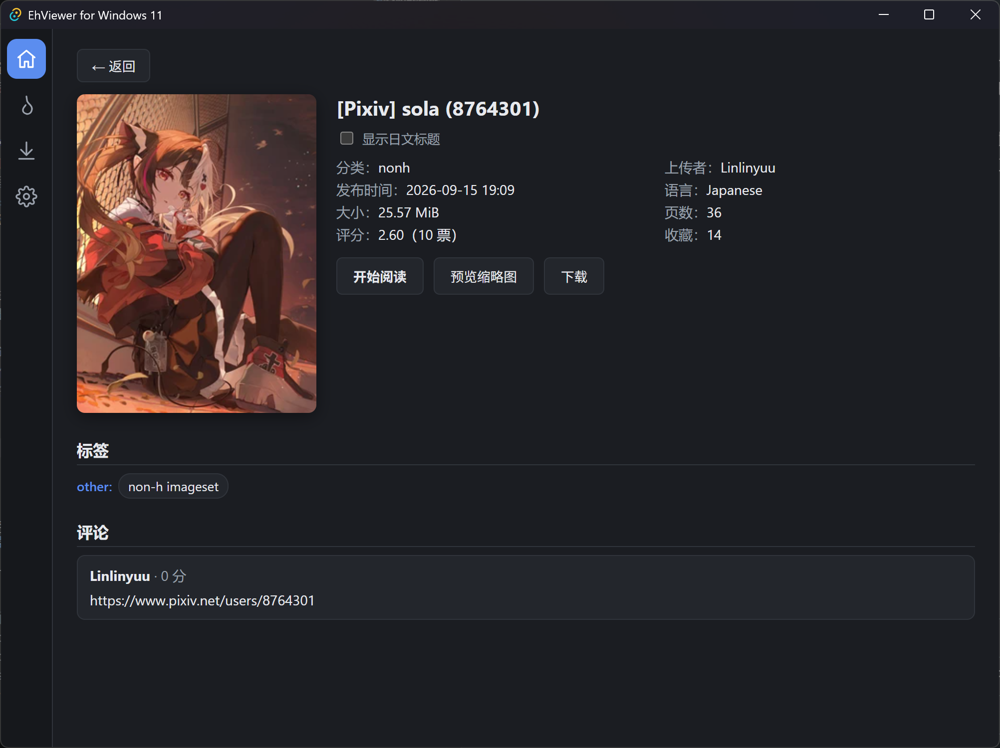
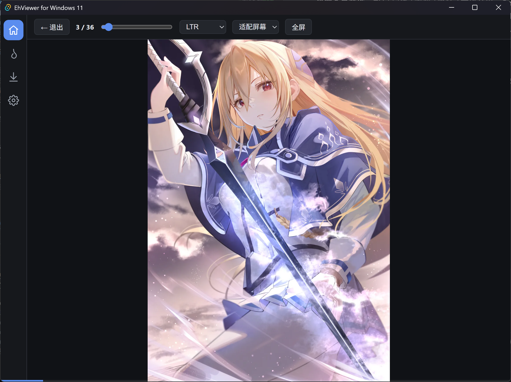
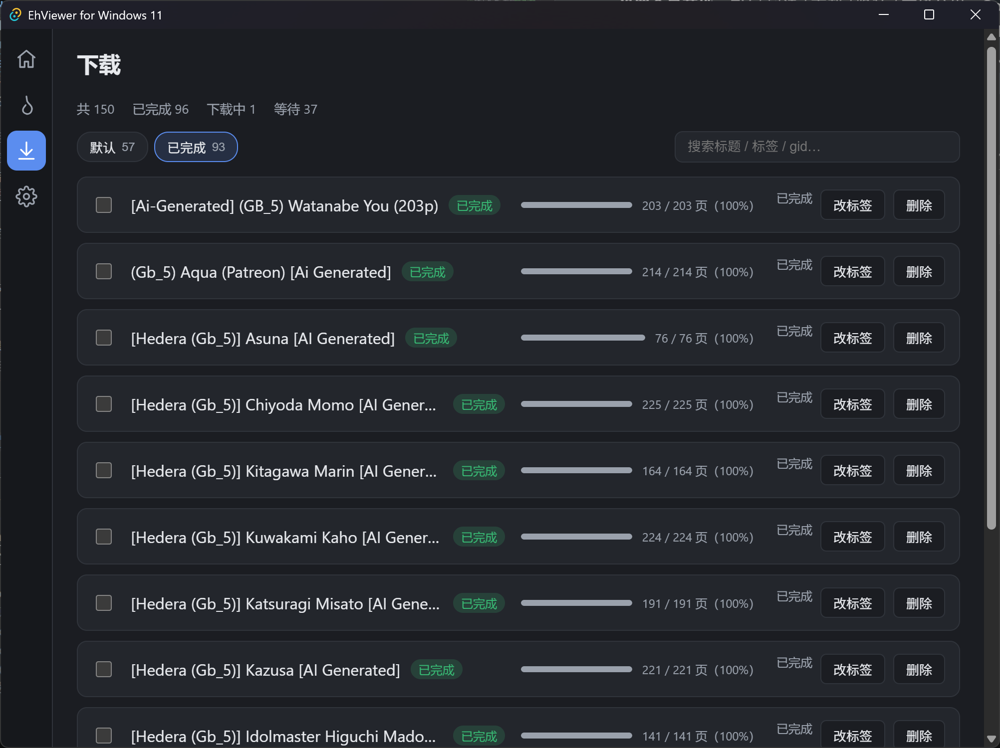
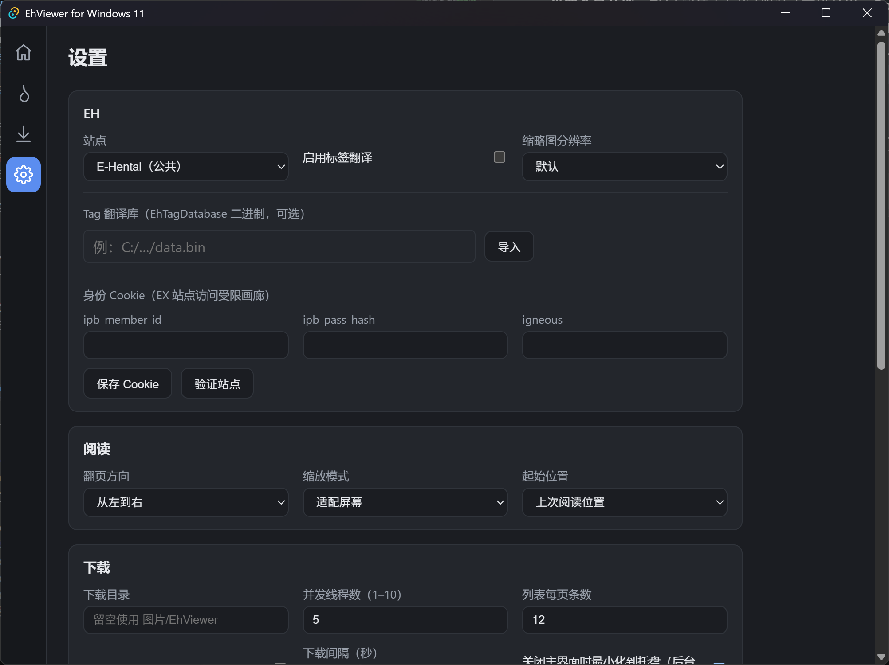

# EhViewer for Windows 11

[](#)
[](#)
[](#)
[](#)
[](#)

> 基于 **Tauri v2 + Rust + React / TypeScript**、从零实现的 E-Hentai Windows 11 桌面客户端。
> 以 `Ehviewer_CN_SXJ`（Android 参考实现，只读）为行为基准，保留核心功能并适配桌面交互。

## 作者碎碎念（置顶）

- 为什么做这个项目：
  因为节点不干净，进不了里站，被下载缺页搞得强迫症爆发，设置下载超时时间后亦无法解决。遂chat coding出这个项目，选windows11桌面端方便后台下载，然后优化下载超时时间防止卡死（0B/s），再给下载队列加循环，解放双手。就是这样捏。

## 目录

- [EhViewer for Windows 11](#ehviewer-for-windows-11)
  - [作者碎碎念（置顶）](#作者碎碎念置顶)
  - [目录](#目录)
  - [功能特性](#功能特性)
  - [界面预览](#界面预览)
  - [技术栈](#技术栈)
  - [快速开始](#快速开始)
    - [环境要求](#环境要求)
    - [安装依赖](#安装依赖)
    - [开发调试](#开发调试)
  - [打包](#打包)
    - [中国网络镜像（可选）](#中国网络镜像可选)
  - [测试](#测试)
  - [项目结构](#项目结构)
  - [网络与直连说明](#网络与直连说明)
  - [开发状态](#开发状态)
  - [相关文档](#相关文档)
  - [免责声明](#免责声明)
  - [致谢 / 来源](#致谢--来源)
  - [License](#license)

## 功能特性

- **四向导航**：主页 / 热门 / 下载 / 设置，详情、预览、在线阅读器作为支撑页面。
- **画廊浏览**：搜索、分类、高级筛选、翻页、网格卡片，点击进入详情。
- **详情 / 预览 / 阅读器**：详情信息、缩略图宫格（分页 + 跳页）、在线阅读器（方向、多种缩放 + Ctrl 滚轮、键盘翻页、指针拖拽、全屏、进度自动保存与续读）。
- **图片加载**：由 Rust 后端 `fetch_image` / `fetch_image_progress` 携带 Referer / Cookie 抓取图片并转为 `data:` URL 渲染（含进度流），带磁盘缓存；`ehimg://` 自定义协议已弃用，仅为兜底保留。
- **下载引擎**：Rust 后台 `SpiderDen` / `SpiderQueen`，支持并发下载、断点续传跳过已存在文件、509 / 超时指数退避重试、暂停 / 恢复、重启后恢复任务。
- **下载目录按标签分夹**：每个下载任务放进 `<下载目录>/<标签>/<gid-标题>` 子文件夹，未设标签归入「默认」；在下载页改标签后自动迁移目录（下载中会等该任务结束再搬，避免写穿目录）。
- **下载进度实时上报**：下载页订阅 `download-progress` 增量更新单条 complete / total，不必整表刷新。
- **设置全量落地**：EH / 阅读 / 下载 / 隐私 / 高级分组，Cookie（ipb_* / igneous）经 Windows DPAPI 加密落盘，设置修改即时应用到 HTTP 客户端。
- **高级网络设置**：代理（直连 / 系统 / HTTP / SOCKS5）、自定义 Host 表、镜像 Host 白名单、超时 / 重试、图片缓存上限、DoH、`close_to_tray` 托盘常驻。
- **系统集成**：单实例运行 + 托盘常驻（最小化到托盘）。
- **网络自适应**：默认使用系统 DNS，冷启动即启用 DoH / 内置 IP 实时解析，失败自动升级兜底，并内置「网络诊断」工具，缓解国内 DNS 污染导致的直连失败。

## 界面预览

| 主页 | 详情 + 侧栏 | 阅读器 | 下载 | 设置 |
| --- | --- | --- | --- | --- |
|  |  |  |  |  |

## 技术栈

| 层次 | 技术 |
| --- | --- |
| 后端 | Rust（Tauri v2）、reqwest（rustls）、SQLite、Windows DPAPI |
| 前端 | React 19、TypeScript、Vite |
| 图片 | Rust 后端 `fetch_image` / `fetch_image_progress` → `data:` URL + 磁盘缓存 |

## 快速开始

### 环境要求

- Windows 11（含 WebView2，Tauri v2 自动处理）
- Node.js ≥ 22（开发环境为 Node 24）与 pnpm（开发环境为 pnpm 11）
- Rust 工具链（rustc / cargo，开发环境为 1.98）

### 安装依赖

```bash
pnpm install
```

### 开发调试

```bash
pnpm tauri dev
```

## 打包

```bash
pnpm tauri build
# NSIS 安装包输出目录:
# src-tauri/target/release/bundle/nsis/
```

### 中国网络镜像（可选）

```bash
# cargo 使用 rsproxy.cn 镜像
# ~/.cargo/config.toml 指向 https://rsproxy.cn
# pnpm / npm 使用 npmmirror registry
```

## 测试

```bash
# 后端 Rust 单元与集成测试（DNS / IP 优选、下载引擎、DPAPI、Parser 等）
cargo test --lib

# 前端构建
pnpm build
```

当前基线：`cargo test --lib` **85 项**全绿；`pnpm build`（tsc + vite）**47 模块**通过。另有本地 mock 的命令层集成测试 `cargo test`（不依赖外网）。

## 项目结构

```text
src-tauri/src/client/     # 爬虫 / 解析 / 网络（EhClient、Parser、DNS、诊断、标签库、缩略图）
src-tauri/src/download/   # 下载引擎（SpiderDen / SpiderQueen，按标签分夹）
src-tauri/src/db.rs       # SQLite 数据层
src-tauri/src/settings.rs # JSON 设置持久化
src-tauri/src/dpapi.rs    # Windows DPAPI 加解密
src-tauri/src/ehimg.rs    # 图片抓取 / data: 渲染 / 磁盘缓存 / 进度流
docs/screenshots/         # 界面截图（占位目录，待补充）
src/                      # 前端（React / TS）
```

## 网络与直连说明

- **默认直连**：HTTP 客户端默认使用系统 DNS 解析；冷启动即启用 DoH / 内置 IP 实时解析，失败时自动升级兜底，避免系统 DNS 污染导致首连连不上。
- **DoH 兜底**：配置 → AliDNS（223.5.5.5）→ dns.alidns.com 三级降级。
- **网络诊断**：设置 → 高级 → “网络诊断”，可区分 **系统 DNS 被污染** 与 **SNI-DPI 阻断** 两类连通性问题，并直接给出建议。
- **代理 / 镜像**：设置 → 高级可配置代理（直连 / 系统 / HTTP / SOCKS5）、自定义 Host 表与镜像 Host 白名单；诊断同样会测带代理的直连。

## 开发状态

- Phase 0–6 功能主体已完成并通过构建与单元测试：工程骨架 → 数据层 / 解析 → 主页 / 热门 → 详情 / 预览 / 阅读器 → 下载引擎 → 设置全量映射 → NSIS 打包收尾。
- 已追加：下载目录按标签分夹与改标签自动迁移、图片下载进度流、托盘常驻、网络冷启动实时解析。
- 待完善：真实站点端到端冒烟（受 Cloudflare / 网络环境限制）、截图与 UI 打磨。

## 相关文档

- [`docs/parity-map.md`](docs/parity-map.md) —— 与 SXJ（Android）功能对齐及省略项说明。

## 免责声明

本项目仅供学习与个人使用。使用时请遵守适用的法律法规与 E-Hentai 的服务条款，避免高并发抓取或滥用。如涉及侵权，请及时联系下架。

## 致谢 / 来源

本项目为 Ehviewer_CN_SXJ（GPL-3.0）的 Windows 桌面行为重实现：仅以 Android 参考实现的行为为基准进行功能对齐，未移植其源码。

## License

本项目基于 GPL-3.0 发布，详见 [`LICENSE`](LICENSE)。